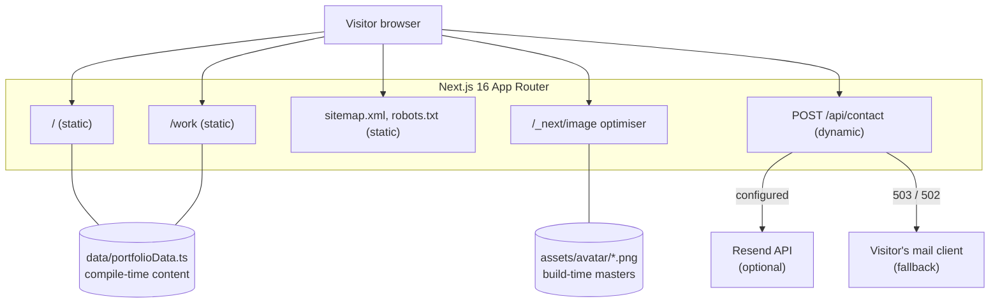

# Architecture

Last reconciled against the codebase: 2026-08-03.

## Shape

A statically prerendered Next.js App Router site with exactly one dynamic
endpoint. There is no database, no authentication and no user-generated content.

## Rendering

| Route | Mode | Why |
| --- | --- | --- |
| `/` | Static | Content is compile-time data; nothing per-request |
| `/work` | Static | Filtering is client state, not a server concern |
| `/sitemap.xml`, `/robots.txt` | Static | Derived from `lib/site.ts` |
| `/api/contact` | Dynamic | Reads request headers for rate limiting |

Interactive sections are client components; the route shells (`app/page.tsx`,
`app/work/page.tsx`) stay server components so only interactive code ships.

## Data ownership

`data/portfolioData.ts` is the only content source, imported directly by the
components that render it. There is no fetching layer because there is nothing
to fetch — content changes ship as a commit and a redeploy.

`lib/site.ts` owns site-level metadata and is consumed by `app/layout.tsx`,
`app/sitemap.ts` and `app/robots.ts` so the three cannot disagree.

## External dependencies and their failure plans

| Dependency | Used for | If it fails |
| --- | --- | --- |
| Resend HTTP API | Contact form delivery | 8s timeout; route returns `502`/`503`; UI shows an error and a `mailto:` link containing the message the visitor already typed |
| Google Fonts | — | Not used. Geist and Syne are bundled from npm, so there is no third-party font request at runtime |
| Next image optimiser | Avatar delivery | Static import means dimensions and a blur placeholder are known at build time; `Avatar` also renders an initials fallback on `onError` |

There is no silent failure path on the contact flow: every outcome either
confirms delivery or hands the visitor a working alternative.

## Single points of failure (consciously accepted)

- **The host.** A single deployment target with no multi-region failover. For a
  portfolio, the cost of redundancy exceeds the cost of downtime.
- **Rate-limit state is per instance.** See
  [ADR 0003](adr/0003-contact-form-delivery.md).

## Where this would need to change

- More than ~20 projects, or non-technical editing → move content to a CMS and
  introduce a fetching/caching layer.
- Storing submissions rather than forwarding them → introduce a database, at
  which point [ADR 0004](adr/0004-no-database.md) must be revisited.
- A hard global rate-limit guarantee → replace the in-memory limiter with a
  shared store.

## Decision records

- [0001 — Static Next.js App Router over a CMS-backed build](adr/0001-static-app-router.md)
- [0002 — CSS-variable design tokens over `dark:` variants](adr/0002-css-variable-theming.md)
- [0003 — Contact delivery via provider API with mailto fallback](adr/0003-contact-form-delivery.md)
- [0004 — No database](adr/0004-no-database.md)
